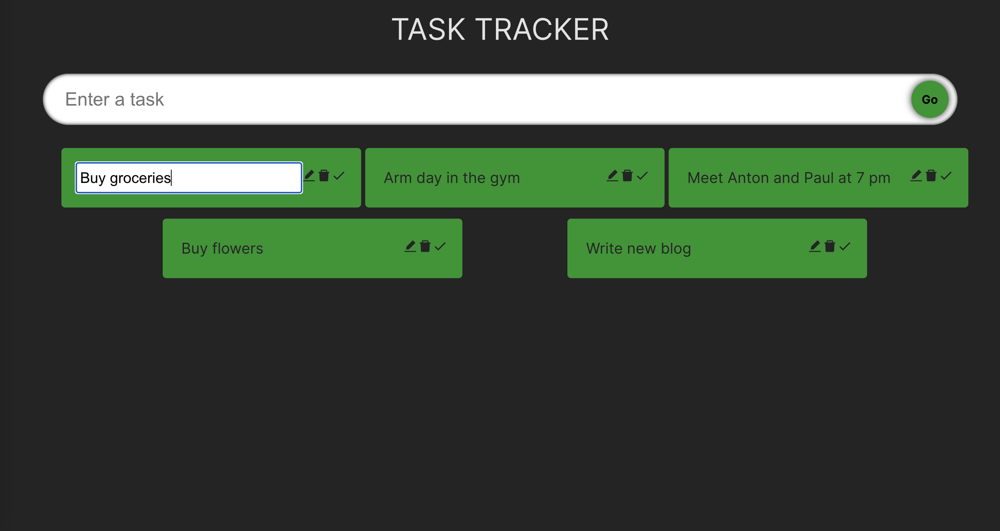

# Task Tracker App

A simple Task Tracker application built with Vite, React.js, and TypeScript. The main goal of this project is to practice the implementation of TypeScript in a React.js application.

## Technologies Used:
[Vite](https://vitejs.dev): A fast build tool for modern web development.
[React.js](https://react.dev): A popular JavaScript library for building user interfaces.
[TypeScript](https://www.typescriptlang.org): A statically typed superset of JavaScript.
[CSS Modules](https://github.com/css-modules/css-modules): For modular and scoped CSS.

## Features

- Add new tasks with a title and optional description.
- Mark tasks as completed.
- Delete tasks.
- Filter tasks by their completion status.
- Responsive design for mobile and desktop.

## Getting Started

To get started with this project, follow these steps:

1. Clone the repository to your local machine:

`git clone https://github.com/vinhnguyendev/task-tracker-typescript.git`

2. Navigate to the project directory:
`cd task-tracker-typescript`

3. Install the project dependencies:
`npm install`

4. Start the development server:
`npm run dev`

Open your browser and visit http://localhost:3000 or  to use the Task Tracker app.